# PracPy.org

Solutions to problems from [Practice Python](https://www.practicepython.org/) by Michele Pratusevich. She was the first inspiring (and kinda terrifying) tech figures I came across growing up. Check out Michele's work [here](https://www.mprat.org/).

```mermaid
flowchart TD
    %% External Entities
    User[👤 User]
    LLM_API[🤖 LLM API<br/>OpenAI/Claude/Ollama]
    
    %% Input Data
    ModelConfig[📋 Model Configuration<br/>- API Keys<br/>- Model Type<br/>- Parameters]
    AppContext[🌐 Application Context<br/>- Base URL<br/>- Page List<br/>- Credentials<br/>- Browser Config]
    RequirementsFile[📄 Requirements File<br/>- User Stories<br/>- Acceptance Criteria<br/>- Business Rules]
    CodebaseZip[📦 Codebase ZIP<br/>- HTML Files<br/>- JavaScript<br/>- CSS<br/>- Config Files]
    
    %% Processing Systems
    FileProcessor{🔄 File Processor}
    CodeAnalyzer{🔍 Code Analyzer}
    TestPlanGen{📝 Test Plan Generator}
    ScriptGen{⚡ Script Generator}
    Packager{📦 Script Packager}
    
    %% Intermediate Data
    ExtractedFiles[(📁 Extracted Files)]
    CodeStructure[(🏗️ Code Structure<br/>- Components<br/>- Pages<br/>- Functions<br/>- Dependencies)]
    UserStories[(📖 Generated User Stories)]
    TestPlan[(📋 Test Plan<br/>- Test Cases<br/>- Scenarios<br/>- Priority)]
    RawScripts[(📜 Raw Scripts)]
    PageObjects[(🏛️ Page Objects)]
    UtilityFunctions[(🛠️ Utility Functions)]
    
    %% Output Data
    PackagedScripts[📥 Packaged Scripts<br/>- Test Files<br/>- Page Objects<br/>- Utilities<br/>- Requirements.txt<br/>- README.md]
    
    %% Data Flow
    User --> ModelConfig
    User --> AppContext
    User --> RequirementsFile
    User --> CodebaseZip
    
    ModelConfig --> TestPlanGen
    ModelConfig --> ScriptGen
    
    CodebaseZip --> FileProcessor
    FileProcessor --> ExtractedFiles
    ExtractedFiles --> CodeAnalyzer
    CodeAnalyzer --> CodeStructure
    
    RequirementsFile --> TestPlanGen
    CodeStructure --> TestPlanGen
    AppContext --> TestPlanGen
    TestPlanGen --> LLM_API
    LLM_API --> UserStories
    UserStories --> TestPlan
    
    TestPlan --> ScriptGen
    CodeStructure --> ScriptGen
    AppContext --> ScriptGen
    ScriptGen --> LLM_API
    LLM_API --> RawScripts
    LLM_API --> PageObjects
    LLM_API --> UtilityFunctions
    
    RawScripts --> Packager
    PageObjects --> Packager
    UtilityFunctions --> Packager
    TestPlan --> Packager
    Packager --> PackagedScripts
    PackagedScripts --> User
    
    %% Styling
    classDef inputData fill:#e1f5fe
    classDef processData fill:#f3e5f5
    classDef intermediateData fill:#fff3e0
    classDef outputData fill:#e8f5e8
    classDef externalEntity fill:#ffebee
    
    class ModelConfig,AppContext,RequirementsFile,CodebaseZip inputData
    class FileProcessor,CodeAnalyzer,TestPlanGen,ScriptGen,Packager processData
    class ExtractedFiles,CodeStructure,UserStories,TestPlan,RawScripts,PageObjects,UtilityFunctions intermediateData
    class PackagedScripts outputData
    class User,LLM_API externalEntity
```

